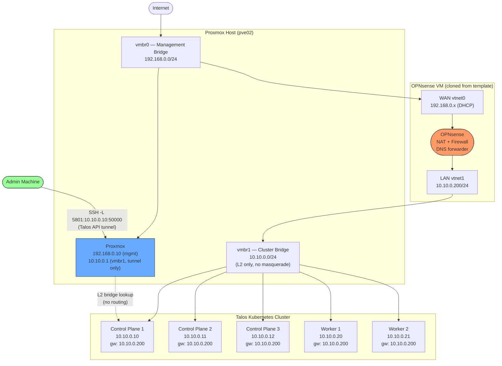

# Network Topology

## Overview

The cluster network is fully isolated behind OPNsense. Proxmox is **not** a router for cluster traffic — it only provides L2 bridge connectivity (vmbr1) and an SSH port-forwarding path for the admin machine to reach the Talos API.

## Topology Diagram



## Key Design Decisions

| Concern | Solution |
|---------|----------|
| Cluster internet access | All cluster egress routes through OPNsense NAT (WAN → vmbr0 → Internet) |
| Proxmox masquerade | **Removed** — vmbr1 has no iptables MASQUERADE rule |
| Talos node default gateway | `10.10.0.200` (OPNsense LAN) set in Talos machine config by Terraform |
| OPNsense pre-configuration | Packer uploads `config.xml` to `/conf/` during template build — no manual UI config needed |
| Admin → Talos API access | SSH port-forward through Proxmox; works via L2 bridge (not routing) — unaffected by gateway change |
| OPNsense boot ordering | OPNsense is created first by Terraform (`talos-network` module dependency); pre-configured config.xml means it routes immediately on first boot |

## Port Reference

| Port | Protocol | Purpose |
|------|----------|---------|
| 6443 | TCP | Kubernetes API server |
| 50000 | TCP | Talos machine API |
| 22 | TCP | SSH to Proxmox (admin access + tunnel entry point) |

## Proxmox vmbr1 Role

Proxmox keeps `10.10.0.1/24` on vmbr1 **only** to satisfy the `bridge_ipv4_address` requirement and to enable L2 reachability for SSH tunnels. When the admin runs:

```bash
ssh -L 5801:10.10.0.10:50000 root@proxmox
```

Proxmox resolves `10.10.0.10` through its directly-connected vmbr1 route (not via any gateway). The packet path is entirely local: `Proxmox kernel → vmbr1 bridge → Talos VM NIC`. The Talos node's default gateway (`10.10.0.200`) is irrelevant to this path.
